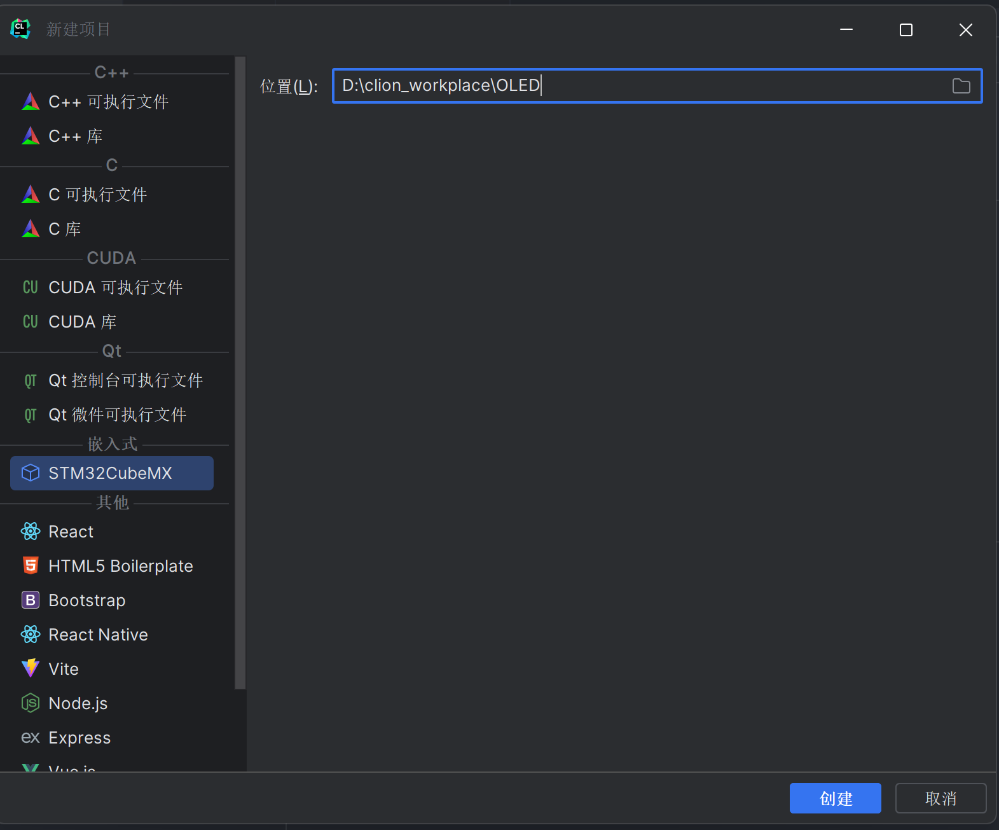

[click here](https://blog.csdn.net/qq_52158753/article/details/130173425?ops_request_misc=%257B%2522request%255Fid%2522%253A%2522170714520516777224442500%2522%252C%2522scm%2522%253A%252220140713.130102334.pc%255Fall.%2522%257D&request_id=170714520516777224442500&biz_id=0&utm_medium=distribute.pc_search_result.none-task-blog-2~all~first_rank_ecpm_v1~rank_v31_ecpm-1-130173425-null-null.142^v99^pc_search_result_base8&utm_term=stm32cubems%E9%A9%B1%E5%8A%A8oled%E5%B1%8F%E6%A8%A1%E5%9D%97iic&spm=1018.2226.3001.4187)

# OLED简介

Organic Light Emitting Diode，有机发光二极管


# Clion+cube配置过程

## 在clion中创建项目



通过clion打开stm32cubemx，把芯片型号换好，正常配置时钟和调试方式，其中在cube有以下不同的地方：


注意工程名字一定要和第一张图里的命名保持一致，点击GENERATE CODE，要出现"do you want to over write it "的提示字样才是正确复写


然后就可以看到这样的界面噜


*接下来配置调试和烧录工具(openOCD)

## openOCD

点击”编辑配置“


然后点击左上角处的+号，选择openOCD


配置好可执行的二进制文件，然后点击面板配置文件的”协助“，选择蓝色药丸（别的也可以，点击复制到项目并使用，然后就可以叉掉这个界面了


回到项目主页面，在文件管理处找到刚刚复制过来的蓝药丸.cfg文件，然后用以下代码替换掉该文件的内容

```
source [find interface/stlink.cfg]
transport select hla_swd

source [find target/stm32f1x.cfg]
adapter speed 10000
```

如图


保存修改即可.

## 调试

在elf左边有个Debug，点它，弹出的选项卡长这样就好（不用特别去改


保存修改后就可以开始锤(编译)和运行噜，插入st-link烧录(点三角形)后可以看到如下成功界面：(红字但是看字不看色)


至此IDE的配置搞定，可以快乐地写代码噜（喜
